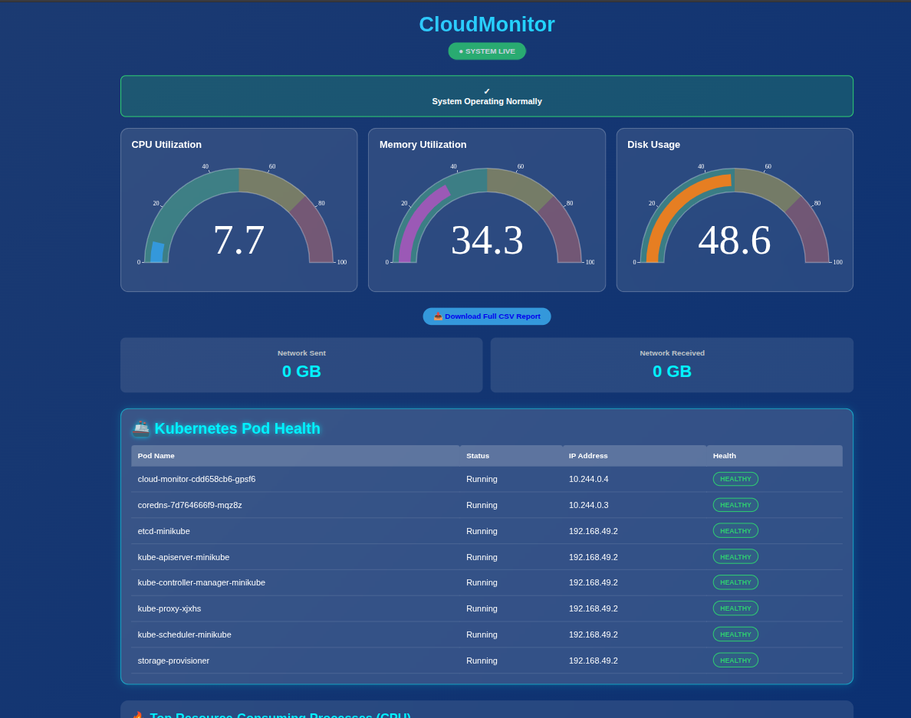

# ☁️ Cloud-Native System Monitor & AI Reporter

A robust Python-based monitoring dashboard designed for local and Kubernetes environments. It features real-time metrics, AI anomaly detection, and automated reporting.

## 🚀 Key Features
* **Real-time Monitoring**: Tracks CPU, RAM, Disk, and Network I/O.
* **AI Anomaly Detection**: Uses historical baselines to detect and alert on unusual resource spikes.
* **Automated Reporting**: Scheduled daily/weekly summaries sent via Gmail SMTP.
* **Health Check API**: Includes `/health` and `/ready` endpoints for Kubernetes probes.
* **Data Persistence**: Local SQLite database for historical analysis and CSV exports.

## 🛠️ Tech Stack
* **Backend**: Flask, Psutil, APScheduler
* **Database**: SQLite3
* **DevOps**: Docker, Kubernetes (Minikube/EKS), Slack Webhooks

## 📥 Local Setup
1. Clone the repo: `git clone <your-repo-link>`
2. Create venv: `python3 -m venv venv`
3. Install dependencies: `pip install -r requirements.txt`
4. Setup `.env` using `.env.example`
5. Run: `python app.py`